<div align="center">

# AI Profile Platform

### _Your Professional Identity, Powered by AI_

**A multi-tenant SaaS platform where professionals host living, conversational versions of themselves — powered by their own documents, backed by RAG, and accessible to the world.**

[](https://python.org)
[](https://fastapi.tiangolo.com)
[](https://trychroma.com)
[](https://openrouter.ai)
[](https://huggingface.co/spaces)
[](https://developers.google.com/identity)

---

[Live Demo](https://arcshukla-ai-profile-platform.hf.space/) · [Quick Start](#-quick-start) · [API Reference](#-api-reference) · [Configuration](#-configuration-reference)

</div>

---

## Table of Contents

- [The Business Problem](#-the-business-problem)
- [What is AI Profile Platform?](#-what-is-ai-profile-platform)
- [Feature Highlights](#-feature-highlights)
- [Architecture Overview](#-architecture-overview)
- [How It Works — User Journeys](#-how-it-works--user-journeys)
- [LLM & AI Design](#-llm--ai-design)
- [RAG Pipeline Deep Dive](#-rag-pipeline-deep-dive)
- [Tech Stack](#-tech-stack)
- [Data & Storage Design](#-data--storage-design)
- [Security & Access Control](#-security--access-control)
- [Billing & Monetization](#-billing--monetization)
- [Deployment — HuggingFace Spaces](#-deployment--huggingface-spaces)
- [Quick Start](#-quick-start)
- [API Reference](#-api-reference)
- [Configuration Reference](#-configuration-reference)
- [Roadmap](#-roadmap)

---

## 🎯 The Business Problem

> **The internet has LinkedIn. It has resumes. It has portfolios. But none of them can hold a _conversation_.**

When someone wants to know about your career — your leadership philosophy, the platforms you've built, your biggest wins — they have to read through walls of static text, piece it together themselves, and walk away with an incomplete picture.

**Recruiters, collaborators, clients, and fans all face the same friction:**

| The Old Way | The AI Profile Platform Way |
|-------------|----------------------|
| Scroll through a LinkedIn profile | Chat naturally in plain English |
| Download a PDF resume and search manually | Ask "What's her biggest engineering achievement?" and get a direct answer |
| Email to ask a follow-up (no reply for days) | Instant, contextual responses — 24/7 |
| Read generic summaries that lose nuance | Answers grounded in the professional's own words and documents |
| One static version for all audiences | AI adapts tone and depth to every visitor's question |

**AI Profile Platform solves this** by giving every professional a **conversational AI twin** — a chat interface backed by their resume, recommendations, project history, and achievements — that anyone can talk to, anytime.

---

## 🚀 What is AI Profile Platform?

AI Profile Platform is a **multi-tenant SaaS platform** that lets professionals create, manage, and publish their own **AI-powered career chat profile**.

Each profile is:

- **Isolated** — its own documents, vector index, system prompt, and configuration
- **Customizable** — custom header HTML, CSS, persona instructions, and follow-up logic
- **Conversational** — visitors chat naturally; the AI answers from real source documents
- **Observable** — owners track token usage, chat logs, and visitor leads
- **Monetizable** — UPI billing with QR code invoices, per-profile tier management

```
Visitor types:  "What's Archana's approach to engineering leadership?"
                              ↓
           AI retrieves relevant chunks from her documents
                              ↓
           LLM generates a grounded, persona-consistent answer
                              ↓
           Follow-up questions surface: "Tell me about the platform she built..."
```

---

## ✨ Feature Highlights

### For Profile Owners

| Feature | Description |
|---------|-------------|
| **Self-Registration** | Sign in with Google → register your profile → go live |
| **Document Upload** | Upload PDFs, DOCX, TXT, CSV, Markdown — up to 3 documents |
| **Smart Indexing** | LLM-powered document splitting and topic extraction (not just chunking) |
| **Custom Persona** | Write your own system prompt — define how your AI twin speaks about you |
| **Chat Customization** | Custom header HTML, CSS, welcome message, and follow-up question style |
| **Lead Capture** | Visitors who share their email are logged and admin-notified via Pushover |
| **Token Dashboard** | See exactly how many LLM tokens your profile consumes |
| **Billing Portal** | View invoices, scan UPI QR codes, track payment status |

### For Platform Admins

| Feature | Description |
|---------|-------------|
| **Profile Registry** | Full CRUD — create, enable, disable, soft/hard delete, restore |
| **Document Management** | Upload and delete documents on behalf of any profile |
| **Indexing Control** | Trigger indexing or force reindex for any profile |
| **System Prompts** | Edit global LLM prompts (split, intent, followup) from the admin UI |
| **Billing Management** | Set billing tiers, generate invoices, confirm UPI payments |
| **User Management** | View registered users, roles, and profile assignments |
| **Live Logs** | Tail application, indexing, and per-profile chat logs in the browser |
| **Token Monitoring** | Platform-wide LLM usage per profile and operation type |

### For Visitors

| Feature | Description |
|---------|-------------|
| **Profile Directory** | Browse and search all public profiles at `/explore` |
| **Conversational Chat** | Natural language Q&A with a professional's AI twin |
| **Smart Follow-ups** | AI suggests 3 contextually relevant next questions after each answer |
| **Zero Friction** | No login required to chat — just visit and ask |

---

## 🏗 Architecture Overview

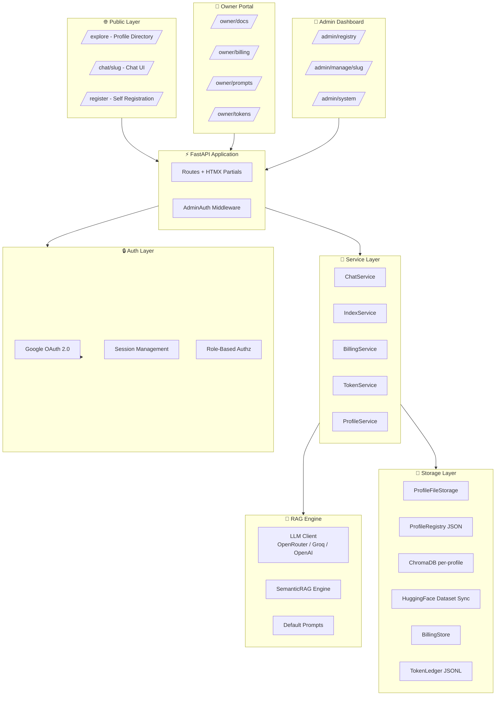

### Request Lifecycle — Chat Turn

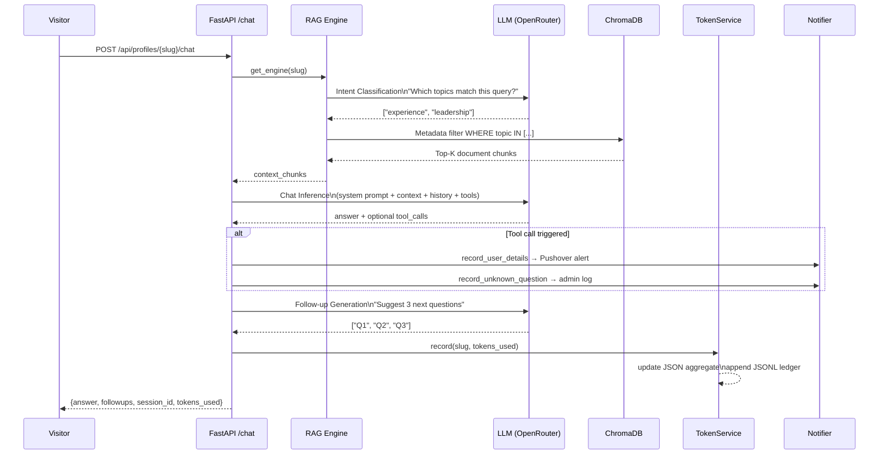

---

## 👤 How It Works — User Journeys

### Journey 1: Professional Registers Their Profile

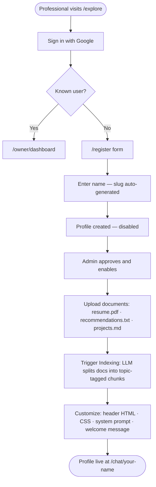

### Journey 2: Visitor Discovers and Chats

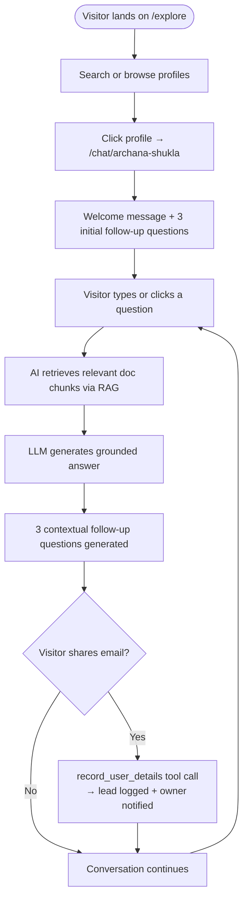

### Journey 3: Admin Operates the Platform

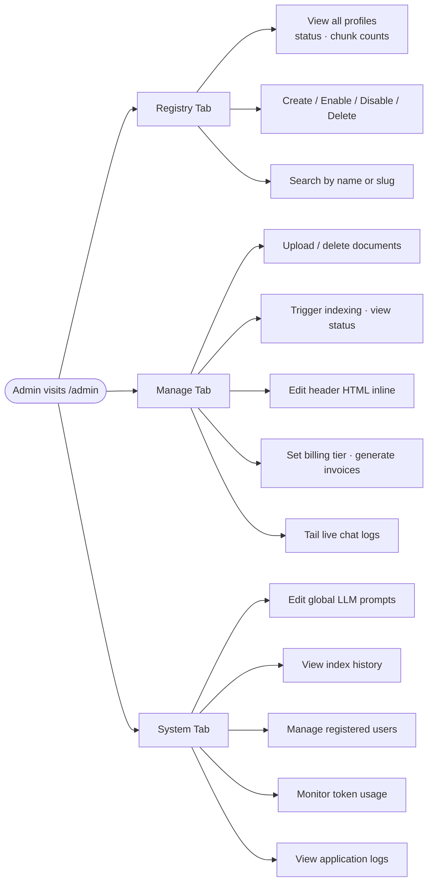

---

## 🧠 LLM & AI Design

### Philosophy

It uses a **two-tier prompt architecture** that keeps the platform grounded and safe while giving owners meaningful customization:

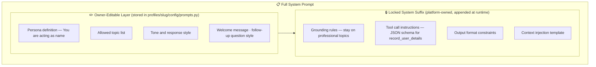

### LLM Provider Flexibility

The platform uses the **OpenAI SDK wire protocol**, making it compatible with any OpenAI-compatible API:

| Provider | Use Case | Notes |
|----------|----------|-------|
| **OpenRouter** | Production (default) | Access to 100+ models via single API |
| **OpenAI** | Direct API access | GPT-4o, GPT-4o-mini, etc. |
| **Groq** | Fast / cost-effective dev | Special handling: no `response_format` + `tools` together |
| **Any OpenAI-compatible** | Self-hosted / custom | Configure `OPENROUTER_BASE_URL` |

**Groq Compatibility Layer**: Groq does not support `response_format` and `tools` in the same request. The LLM client automatically detects Groq and injects JSON formatting instructions into the system message instead — zero code changes needed when switching providers.

### LLM Operations by Type

| Operation | Temperature | Max Tokens | Purpose |
|-----------|-------------|-----------|---------|
| **Chat (main turn)** | 0.2 | 400 | Answer visitor questions |
| **Intent classification** | 0.0 | 200 | Classify query into topics |
| **Document splitting** | 0.1 | 4000 | Extract topic-tagged sections from docs |
| **Follow-up generation** | 0.0 | 300 | Generate 3 contextual next questions |

### Tool Calling

The AI is equipped with two tools that enable real-world actions during chat:

```python
# Tool 1: Lead Capture
record_user_details(
    email: str,     # required — visitor's contact email
    name: str,      # optional
    notes: str      # optional context about their interest
)
# → Logs contact info + sends Pushover notification to owner

# Tool 2: Knowledge Gap Detection
record_unknown_question(
    question: str   # the question the AI couldn't answer from documents
)
# → Logs gap + notifies admin to add better source material
```

---

## 🔍 RAG Pipeline Deep Dive

It uses **Semantic RAG with LLM-powered topic indexing** — a step beyond naive chunking.

### Indexing Pipeline

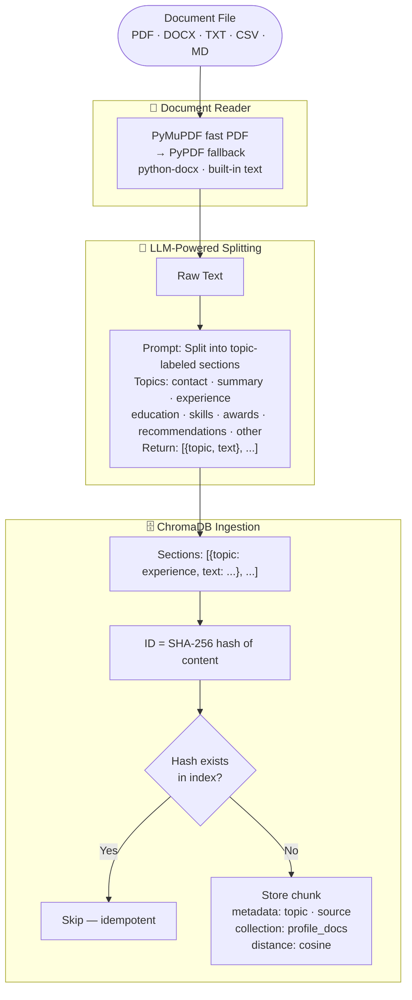

### Retrieval Pipeline

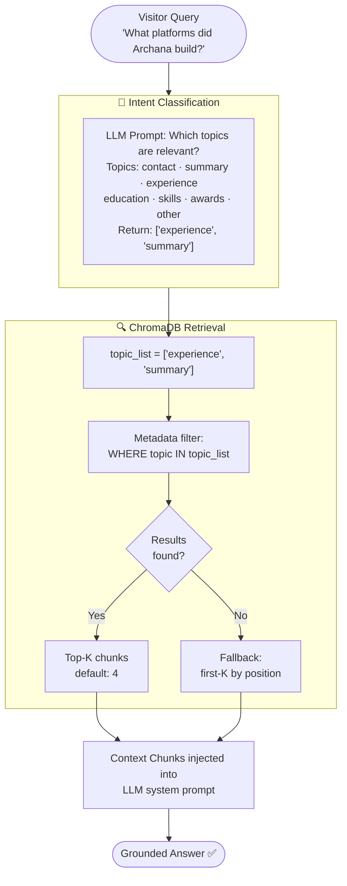

### Why Topic-Based Retrieval?

Traditional ANN (approximate nearest neighbor) embedding search can miss topically relevant content if query phrasing doesn't match embeddings well — especially for short factual questions about people.

Topic-based metadata filtering ensures:
- Questions about "career history" always retrieve `experience` chunks
- Questions about "education" always retrieve `education` chunks
- The LLM knows *why* each chunk was retrieved (topic label in metadata)

This is combined with ChromaDB's cosine similarity for ranking within the filtered set.

---

## 🛠 Tech Stack

### Core Framework

| Layer | Technology | Why |
|-------|-----------|-----|
| **Web Framework** | FastAPI | Async-native, auto-docs, clean dependency injection |
| **ASGI Server** | Uvicorn | Production-grade, HuggingFace Spaces compatible |
| **Templating** | Jinja2 | Server-side rendering, zero JS framework overhead |
| **Dynamic UI** | HTMX | Reactive admin dashboard without a full SPA |
| **Validation** | Pydantic v2 | Strict typing for all API models and config |

### AI & LLM

| Component | Technology | Why |
|-----------|-----------|-----|
| **LLM API** | OpenAI SDK + OpenRouter | Multi-model access via single client |
| **Vector Store** | ChromaDB | Embedded, no separate service, per-profile isolation |
| **Embeddings** | ChromaDB default (sentence-transformers) | No external embedding API needed |
| **RAG Strategy** | LLM-powered topic splitting + metadata filter | Semantic accuracy over keyword luck |

### Authentication & Security

| Component | Technology | Why |
|-----------|-----------|-----|
| **OAuth** | Google OAuth 2.0 via Authlib | Passwordless, trusted, frictionless |
| **Sessions** | Starlette SessionMiddleware | Signed cookies, server-side state |
| **Authorization** | Custom middleware + FastAPI deps | Role-based: admin / owner / anonymous |

### Storage & Persistence

| Component | Technology | Why |
|-----------|-----------|-----|
| **Profile Data** | Filesystem (`profiles/{slug}/`) | Portable, inspectable, no DB required |
| **Registry** | JSON files with atomic writes | Simple, human-readable, crash-safe |
| **Token Ledger** | JSONL append-only file | Audit trail, zero overhead |
| **Cloud Backup** | HuggingFace Dataset repo | Free persistent storage for HF Spaces |

### Document Processing

| Format | Library | Notes |
|--------|---------|-------|
| **PDF** | PyMuPDF → PyPDF (fallback) | PyMuPDF is ~10x faster; PyPDF handles edge cases |
| **DOCX** | python-docx | Native paragraph extraction |
| **TXT / MD / CSV** | Built-in | Direct read, size-checked |

### Infrastructure

| Component | Technology |
|-----------|-----------|
| **Containerization** | Docker (Python 3.11-slim) |
| **Hosting** | HuggingFace Spaces (Docker SDK) |
| **Notifications** | Pushover (lead capture alerts) |
| **Billing / Payments** | UPI deep links + QR code (`qrcode[pil]`) |

---

## 💾 Data & Storage Design

### Filesystem Layout

```
multiprofile/
├── profiles/                        # All profile data (one folder per profile)
│   └── {slug}/
│       ├── photo.jpg                # Profile avatar
│       ├── docs/                    # Uploaded source documents
│       │   ├── resume.pdf
│       │   ├── recommendations.txt
│       │   └── projects.md
│       ├── chromadb/                # Per-profile vector index (ChromaDB persistent)
│       │   ├── chroma.sqlite3
│       │   └── index/
│       └── config/
│           ├── header.html          # Custom chat page header
│           ├── profile.css          # Custom styles
│           └── prompts.py           # Owner-editable prompts
│
├── system/                          # Platform-wide data
│   ├── profiles.json                # Profile registry (all profiles + metadata)
│   ├── users.json                   # User → role + slug mapping
│   ├── billing.json                 # Billing tiers + invoice history
│   ├── token_usage.json             # Aggregated token counts per profile
│   ├── token_ledger.jsonl           # Append-only per-operation token log
│   └── index_history.log            # Indexing events audit trail
│
├── logs/                            # Application logs
│   ├── app.log
│   ├── indexing.log
│   ├── chat.log
│   └── profile_{slug}.log           # Per-profile activity
│
└── static/
    └── qr/                          # Generated UPI QR code PNGs
        └── inv_{id}.png
```

### Key Data Models

#### Profile Registry (`system/profiles.json`)

```json
{
  "profiles": [
    {
      "name": "Archana Shukla",
      "slug_name": "archana-shukla",
      "status": "enabled",
      "base_folder": "profiles/archana-shukla"
    }
  ]
}
```

#### User Registry (`system/users.json`)

```json
{
  "user@example.com": {
    "role": "owner",
    "slug": "archana-shukla",
    "name": "Archana Shukla",
    "created_at": "2026-03-27T10:00:00Z"
  }
}
```

#### Billing Entry (`system/billing.json`)

```json
{
  "archana-shukla": {
    "slug": "archana-shukla",
    "tier": "paid_individual",
    "invoices": [{
      "id": "inv_abc12345",
      "amount": 10.0,
      "currency": "INR",
      "period_start": "2026-03-01",
      "period_end": "2026-03-31",
      "due_date": "2026-03-31",
      "status": "pending",
      "upi_uri": "upi://pay?pa=user@bank&pn=AI+Profile&am=10.00&cu=INR",
      "qr_path": "qr/inv_abc12345.png",
      "created_at": "2026-03-27T10:00:00Z"
    }]
  }
}
```

#### Token Ledger (`system/token_ledger.jsonl`)

```jsonl
{"ts":"2026-03-28T10:00:00Z","slug":"archana-shukla","op":"indexing","prompt":500,"completion":300,"total":800}
{"ts":"2026-03-28T10:05:00Z","slug":"archana-shukla","op":"intent","prompt":120,"completion":80,"total":200}
{"ts":"2026-03-28T10:06:00Z","slug":"archana-shukla","op":"query","prompt":1400,"completion":350,"total":1750}
```

---

## 🔒 Security & Access Control

### Role Model

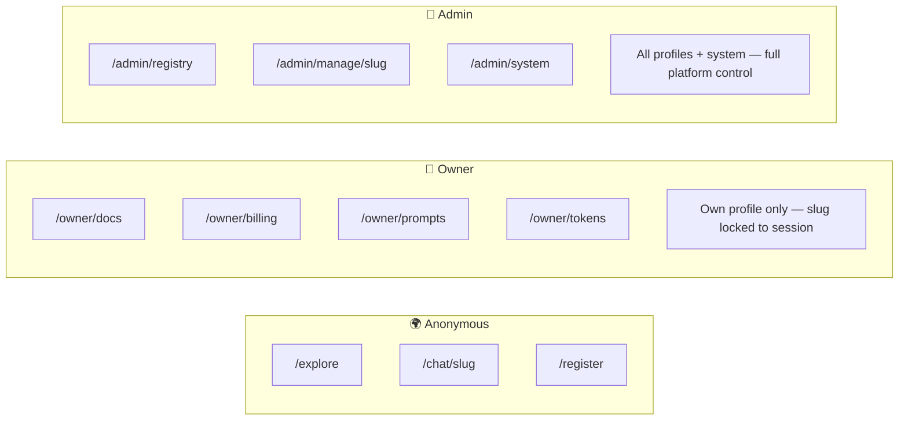

### Authentication Flow

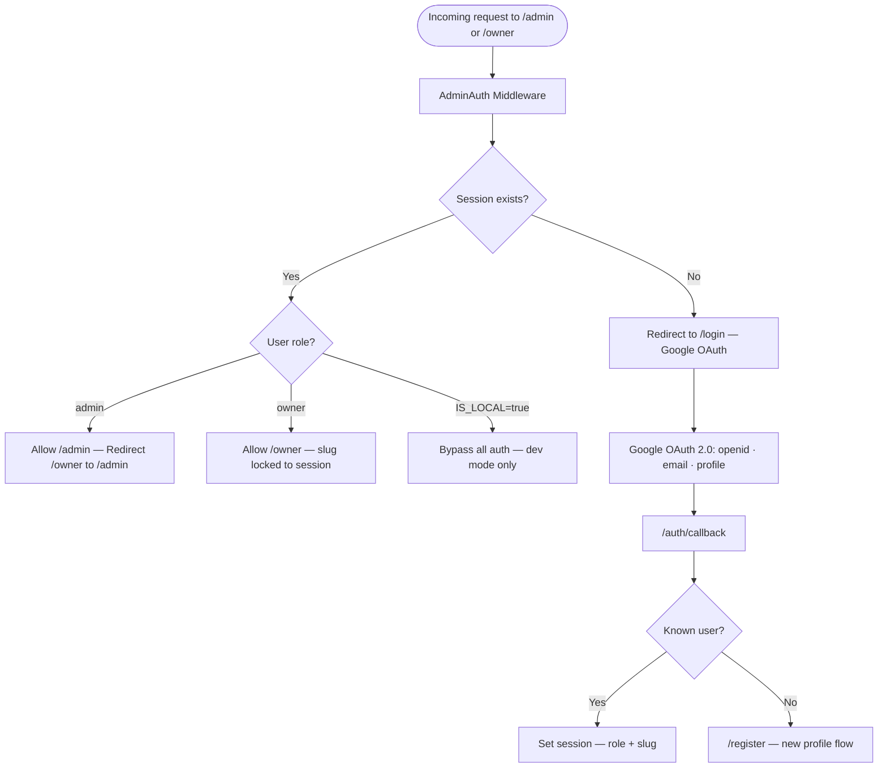

### Key Security Properties

| Property | Implementation |
|----------|----------------|
| **Zero cross-owner access** | Owner slug comes from session, never the URL parameter |
| **Admin bootstrapping** | `ADMIN_EMAILS` env var — no database entry required |
| **File upload safety** | Extension whitelist + size limits (5 MB PDF, 1 MB others, max 3 docs) |
| **Session integrity** | Signed + encrypted cookie via `itsdangerous` |
| **HTTPS enforcement** | Forced on HF Spaces (proxy-aware redirect logic) |
| **No code execution** | Documents read as text only — no eval, no exec |
| **Atomic writes** | Registry writes via `.json.tmp` → rename (crash-safe) |

---

## 💳 Billing & Monetization

### Billing Tiers

| Tier | Description |
|------|-------------|
| `free` | Profile active, no billing |
| `paid_individual` | Monthly UPI invoice (amount configurable via env) |
| `paid_enterprise` | Custom billing (Phase 2) |

### Invoice & Payment Flow

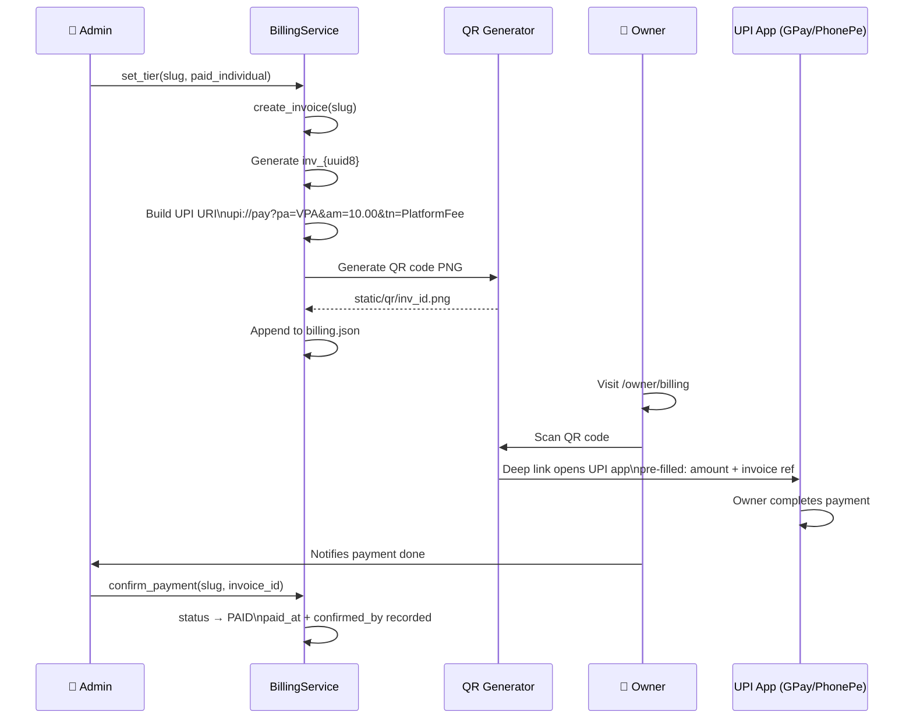

> **Phase 2 Roadmap**: Automated payment detection via Razorpay or Stripe webhooks — eliminating the manual confirmation step.

---

## ☁️ Deployment — HuggingFace Spaces

It is designed to run **for free on HuggingFace Spaces** with persistent storage via HF Datasets.

### The Persistence Challenge

HuggingFace Spaces use ephemeral containers — every restart wipes the filesystem. AI Profile Platform solves this with **automatic sync to a private HF Dataset repository**.

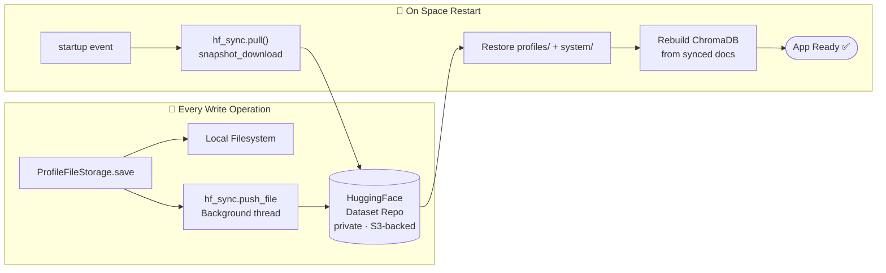

### What Gets Synced

| Path | Synced | Notes |
|------|--------|-------|
| `profiles/{slug}/docs/` | Per write | Source documents |
| `profiles/{slug}/config/` | Per write | Prompts, header, CSS |
| `profiles/{slug}/photo.jpg` | Per write | Profile avatar |
| `system/` | Per write | Registry, users, billing, tokens |
| `logs/` | Periodic (5 min) | Batched log rotation sync |
| `profiles/{slug}/chromadb/` | Never | Binary, large — rebuilt from docs on restart |

### Setup Steps

```bash
# 1. Create a new Space on HuggingFace (Docker SDK)
# 2. Add Space Secrets:
OPENROUTER_API_KEY=sk-or-v1-...
GOOGLE_CLIENT_ID=<your-google-client-id>
GOOGLE_CLIENT_SECRET=<your-google-client-secret>
SESSION_SECRET_KEY=<strong-random-value>
ADMIN_EMAILS=your@email.com
HF_STORAGE_REPO=your-username/profile-storage   # private dataset repo
HF_TOKEN=hf_write_token_here
UPI_VPA=yourupi@bankhandle
# 3. Push code to Space → Docker image builds automatically
# 4. App detects HF_SPACE_ID → enables persistent sync
```

### Dockerfile

```dockerfile
FROM python:3.11-slim

# System deps for PyMuPDF (PDF parsing) + ChromaDB (hnswlib)
RUN apt-get install -y libglib2.0-0 libgl1 build-essential g++ cmake

COPY requirements.txt .
RUN pip install --no-cache-dir -r requirements.txt

COPY . /app
WORKDIR /app

RUN mkdir -p profiles system logs static/qr

EXPOSE 7860
CMD ["uvicorn", "app.main:app", "--host", "0.0.0.0", "--port", "7860"]
```

---

## ⚡ Quick Start

### Prerequisites

- Python 3.11+
- An OpenRouter, OpenAI, or Groq API key
- Google OAuth 2.0 credentials ([setup guide](https://developers.google.com/identity/protocols/oauth2))

### Local Development

```bash
# 1. Clone the repository
git clone https://github.com/your-org/ai_profile_platform.git
cd ai_profile_platform

# 2. Create virtual environment
python -m venv venv
source venv/bin/activate   # Windows: venv\Scripts\activate

# 3. Install dependencies
pip install -r requirements.txt

# 4. Configure environment
cp .env.example .env
```

Edit `.env` with minimum required settings:

```env
# LLM
OPENROUTER_API_KEY=sk-or-v1-your-key-here
AI_MODEL=openai/gpt-4o-mini

# Auth
GOOGLE_CLIENT_ID=your-google-client-id
GOOGLE_CLIENT_SECRET=your-google-client-secret
SESSION_SECRET_KEY=any-random-string-for-local-dev
ADMIN_EMAILS=your-email@gmail.com

# Dev mode (disables auth checks)
IS_LOCAL=true
```

```bash
# 5. Run the application
uvicorn app.main:app --reload --host 0.0.0.0 --port 7860

# 6. Open in browser
# http://localhost:7860/admin       → Admin dashboard
# http://localhost:7860/explore     → Public profile directory
```

### First Profile Setup

1. Visit `http://localhost:7860/admin`
2. **Registry tab** → Create Profile → enter a name (e.g. "Jane Doe")
3. **Manage tab** → Select "Jane Doe" → upload documents (resume, bio, etc.)
4. **Manage tab** → Click "Index Documents" → wait for completion
5. **Registry tab** → Enable the profile
6. Visit `http://localhost:7860/chat/jane-doe` — your AI profile is live

---

## 📡 API Reference

All endpoints are documented at `/docs` (Swagger UI) when running locally.

### Chat

```http
POST /api/profiles/{slug}/chat
Content-Type: application/json

{
  "message": "What's her biggest technical achievement?",
  "history": [
    {"role": "user", "content": "Tell me about her background"},
    {"role": "assistant", "content": "She has 15 years of..."}
  ],
  "session_id": "optional-session-id"
}
```

**Response:**
```json
{
  "answer": "Her biggest technical achievement was building...",
  "followups": [
    "What technologies did she use for that platform?",
    "How large was the team she led?",
    "What was the business impact?"
  ],
  "session_id": "uuid-here",
  "tokens_used": {
    "prompt_tokens": 1200,
    "completion_tokens": 280,
    "total_tokens": 1480,
    "call_count": 2
  }
}
```

### Key Endpoints

| Method | Path | Description |
|--------|------|-------------|
| `GET` | `/api/profiles` | List all profiles |
| `POST` | `/api/profiles` | Create profile |
| `GET` | `/api/profiles/{slug}` | Get profile details |
| `PATCH` | `/api/profiles/{slug}/status` | Enable / disable |
| `DELETE` | `/api/profiles/{slug}/soft` | Soft delete |
| `DELETE` | `/api/profiles/{slug}` | Hard delete |
| `POST` | `/api/profiles/{slug}/restore` | Restore deleted |
| `GET` | `/api/profiles/{slug}/documents` | List documents |
| `POST` | `/api/profiles/{slug}/documents` | Upload document |
| `DELETE` | `/api/profiles/{slug}/documents/{fn}` | Delete document |
| `GET` | `/api/profiles/{slug}/index` | Index status |
| `POST` | `/api/profiles/{slug}/index` | Trigger indexing |
| `POST` | `/api/profiles/{slug}/index/force` | Force reindex |
| `POST` | `/api/profiles/{slug}/chat` | Chat turn |
| `GET` | `/api/profiles/{slug}/chat/welcome` | Welcome + initial followups |
| `GET` | `/api/profiles/{slug}/prompts` | Get prompts |
| `PATCH` | `/api/profiles/{slug}/prompts` | Update a prompt |
| `POST` | `/api/profiles/{slug}/prompts/restore` | Restore defaults |
| `GET` | `/api/system/index-history` | Indexing audit log |
| `GET` | `/api/logs/{log_type}` | Read application logs |

---

## ⚙️ Configuration Reference

| Variable | Default | Required | Description |
|----------|---------|----------|-------------|
| `OPENROUTER_API_KEY` | — | Yes | LLM API key (OpenRouter / OpenAI / Groq) |
| `OPENROUTER_BASE_URL` | `https://openrouter.ai/api/v1` | — | LLM API endpoint |
| `AI_MODEL` | `openai/gpt-4o-mini` | — | Model identifier |
| `GOOGLE_CLIENT_ID` | — | Yes | Google OAuth client ID |
| `GOOGLE_CLIENT_SECRET` | — | Yes | Google OAuth client secret |
| `SESSION_SECRET_KEY` | — | Yes | Session cookie signing key (strong random in prod) |
| `ADMIN_EMAILS` | — | Yes | Comma-separated admin email addresses |
| `IS_LOCAL` | `false` | — | `true` = skip auth (dev only) |
| `DEBUG` | `false` | — | FastAPI debug mode |
| `LOG_LEVEL` | `INFO` | — | Logging verbosity |
| `HOST` | `0.0.0.0` | — | Server bind address |
| `PORT` | `7860` | — | Server bind port |
| `CHUNK_SIZE` | `1024` | — | RAG chunk size (characters) |
| `CHUNK_OVERLAP` | `128` | — | RAG chunk overlap (characters) |
| `RAG_TOP_K` | `4` | — | Chunks to retrieve per query |
| `PROFILE_CACHE_MINUTES` | `20` | — | Document ingest cache window |
| `UPI_VPA` | — | Billing | UPI account ID (e.g. `user@okhdfc`) |
| `UPI_PAYEE_NAME` | `AI Profile Platform` | — | Name shown on UPI receipts |
| `PLATFORM_FEE_INR` | `10` | — | Monthly platform fee in INR |
| `BILLING_INTERVAL_DAYS` | `30` | — | Billing cycle length |
| `HF_STORAGE_REPO` | — | HF only | HuggingFace Dataset repo (`user/repo`) |
| `HF_TOKEN` | — | HF only | HuggingFace write-capable token |
| `HF_LOG_SYNC_INTERVAL_MINUTES` | `5` | — | Log sync frequency to HF |
| `SUPPORT_EMAIL` | `support@aiprofile.app` | — | Support contact shown in UI |

---

## 🗺 Roadmap

### Phase 2 — Scale & Automate

- [ ] **PostgreSQL + pgvector** — replace file-based registry for multi-instance scale
- [ ] **Automated payments** — Razorpay / Stripe webhooks (no manual admin confirmation)
- [ ] **Semantic ANN retrieval** — vector similarity + reranking alongside topic filter
- [ ] **Prompt versioning** — track and rollback prompt changes over time

### Phase 3 — Analytics & Growth

- [ ] **Chat analytics dashboard** — volume, session depth, unanswered questions
- [ ] **A/B testing prompts** — compare conversion rates across prompt variations
- [ ] **Multi-language support** — prompts and chat in the visitor's detected language
- [ ] **Custom domains** — CNAME support for `/chat/{slug}` pages
- [ ] **Embedding model choice** — swap sentence-transformers for text-embedding-3-small, etc.
- [ ] **Rate limiting** — per-profile and platform-wide chat throttling

---

## Extending the Platform

### Add a new document type
Edit [app/utils/file_utils.py](app/utils/file_utils.py) — add a branch for the new extension.

### Add a new LLM provider
Update `.env` — point `OPENROUTER_BASE_URL` to any OpenAI-compatible endpoint.

### Add a new field to profiles
1. Add to `ProfileEntry` in [app/models/profile_models.py](app/models/profile_models.py)
2. Update `ProfileRegistryStore._save()` in [app/storage/profile_registry.py](app/storage/profile_registry.py) to include the field
3. No other changes needed — the registry is schema-flexible

### Replace file storage with a database
1. Implement the same interface as `ProfileRegistryStore` backed by SQLAlchemy
2. Implement the same interface as `ProfileFileStorage` backed by S3 / GCS
3. Swap the singletons in [app/storage/](app/storage/) — no service layer changes needed

---

<div align="center">

**Built with FastAPI · ChromaDB · OpenRouter · HuggingFace Spaces**

_Making every professional's story conversational._

</div>
