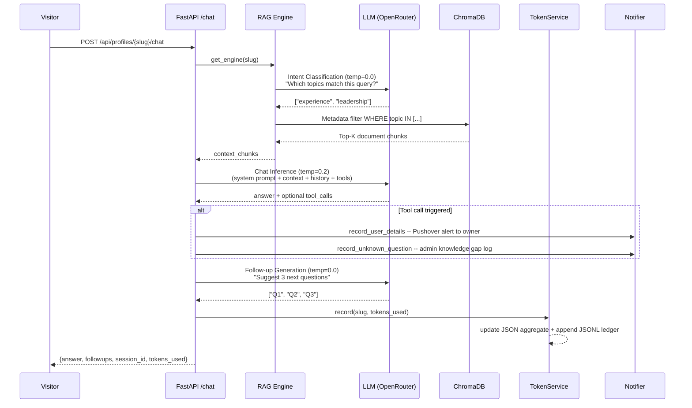
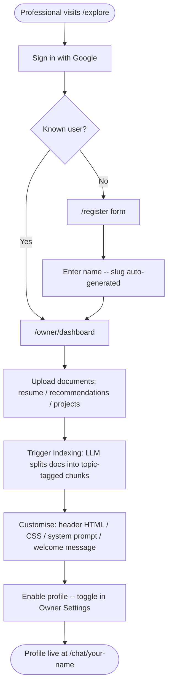
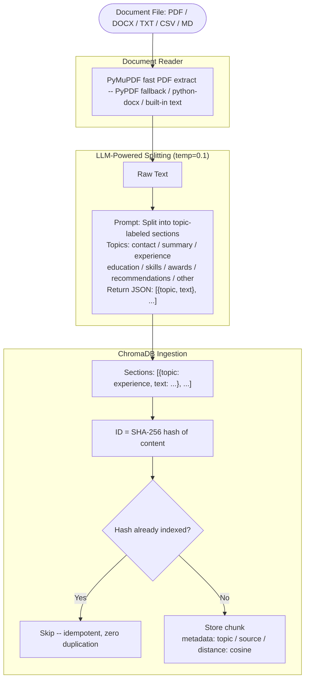
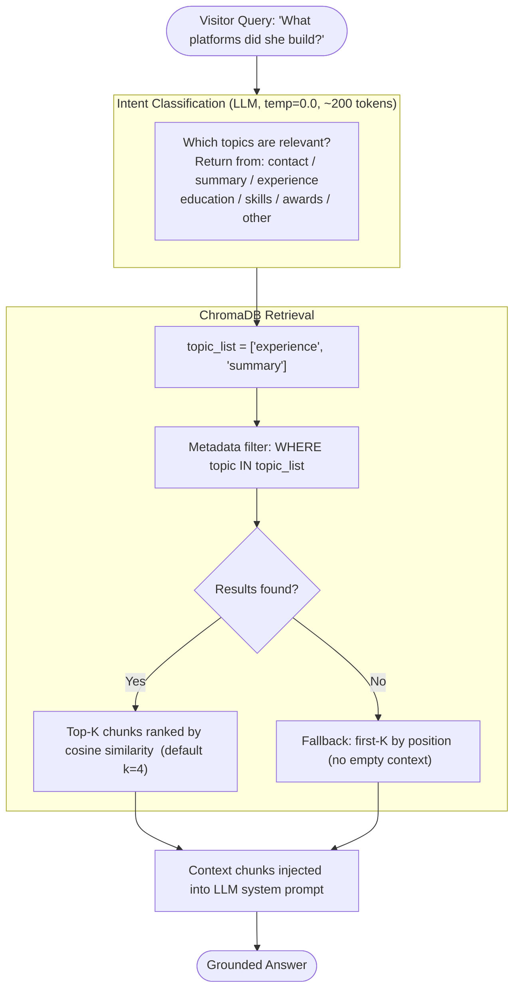
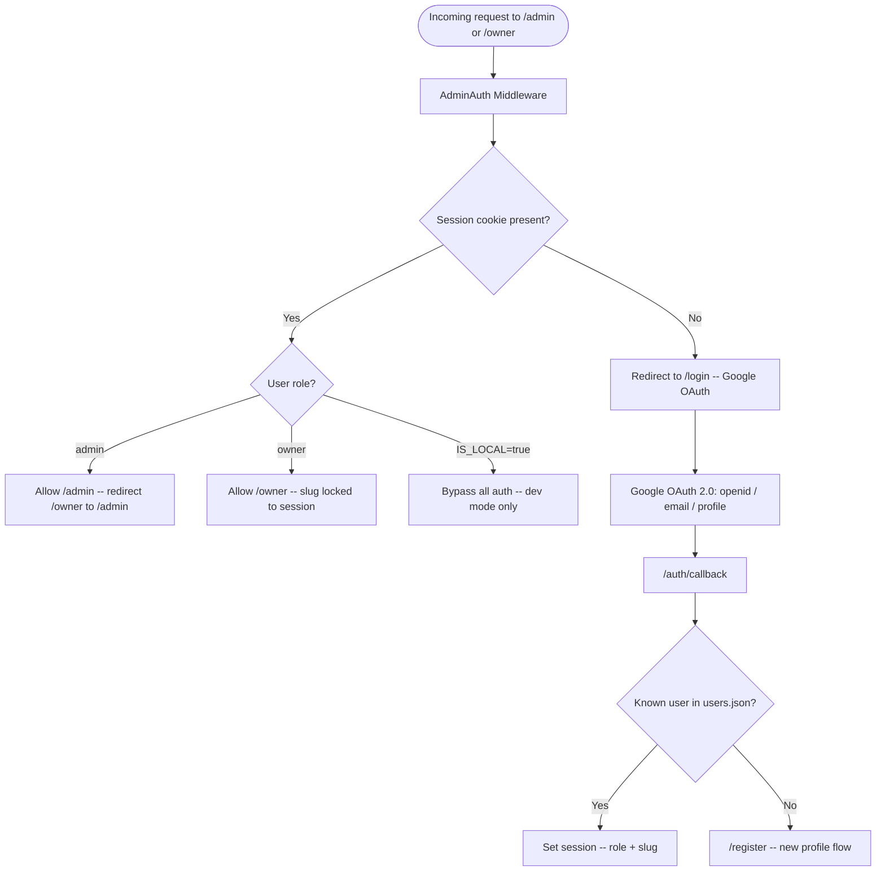
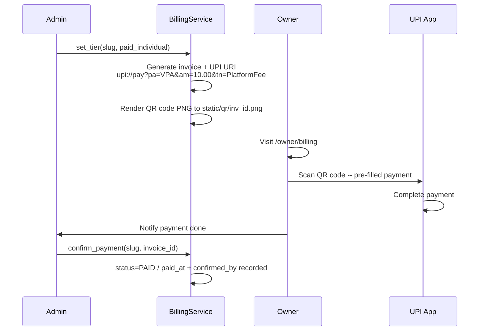
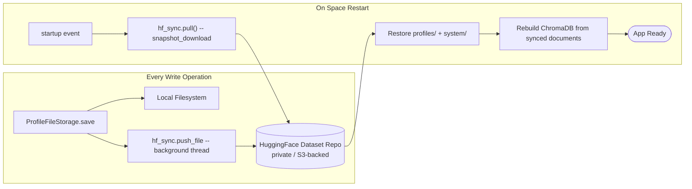

<div align="center">

# AI Profile Platform

### _Your Professional Identity, Powered by AI_

**A multi-tenant SaaS platform where professionals host living, conversational versions of themselves —
powered by their own documents, grounded by RAG, and accessible to the world.**

[](https://python.org)
[](https://fastapi.tiangolo.com)
[](https://trychroma.com)
[](https://openrouter.ai)
[](https://huggingface.co/spaces)
[](https://developers.google.com/identity)
[](LICENSE)

---

[Live Demo](https://arcshukla-ai-profile-platform.hf.space/) &nbsp;·&nbsp;
[Quick Start](#-quick-start) &nbsp;·&nbsp;
[Architecture](#-technical-architecture) &nbsp;·&nbsp;
[API Reference](#-api-reference) &nbsp;·&nbsp;
[Configuration](#-configuration-reference)

</div>

---

## Table of Contents

**Product**
- [The Problem With Professional Profiles](#-the-problem-with-professional-profiles)
- [The Idea](#-the-idea)
- [Product Vision](#-product-vision)
- [Key Features](#-key-features)
- [Example Conversations](#-example-conversations)
- [Business Potential](#-business-potential)

**Technical**
- [Technical Architecture](#-technical-architecture)
- [Technical Design — RAG, LLM & Engineering Decisions](#-technical-design--rag-llm--engineering-decisions)
- [Tech Stack](#-tech-stack)
- [Data & Storage Design](#-data--storage-design)
- [Security & Access Control](#-security--access-control)
- [Billing & Monetization](#-billing--monetization)

**Getting Started**
- [Quick Start](#-quick-start)
- [API Reference](#-api-reference)
- [Configuration Reference](#-configuration-reference)
- [Deployment — HuggingFace Spaces](#-deployment--huggingface-spaces)

**Looking Forward**
- [Roadmap](#-roadmap)
- [Extending the Platform](#extending-the-platform)
- [Why This Matters](#-why-this-matters)
- [A Note on Building This](#-a-note-on-building-this)

---

## The Problem With Professional Profiles

> **The internet has LinkedIn. It has resumes. It has portfolios. But none of them can hold a _conversation_.**

When someone wants to understand your career — your leadership philosophy, the platforms you built, your biggest bets, your engineering judgment — they must scroll through walls of static text, piece together a narrative themselves, and still walk away with an incomplete picture.

Professionals spend enormous effort crafting their story: distilling years of work into one page, trimming nuance to fit bullet points, hoping a recruiter will read between the lines. The result is a chronic mismatch between the depth of someone's actual experience and the thin slice a static document can convey.

**Every stakeholder in the hiring and collaboration ecosystem feels this friction:**

| The Old Way | The AI Profile Platform Way |
|---|---|
| Scroll through a LinkedIn profile and guess at impact | Chat naturally: _"What's her biggest engineering achievement?"_ |
| Download a PDF and search it manually | Instant, contextual answers grounded in real source documents |
| Email a follow-up and wait days for a reply | 24/7 conversational access — no intermediary required |
| Read generic summaries that strip away nuance | Responses in the professional's own documented voice |
| One static presentation fits all audiences | The AI adapts depth and emphasis to every question asked |
| Achievements listed without context or scale | Answers that explain the _why_ behind what was built |

**AI Profile Platform** solves this by giving every professional a **conversational AI twin** — a chat interface backed by their real documents — that anyone can talk to, anytime, without friction.

---

## The Idea

The core insight is simple but powerful: **every professional already has rich documentation of their career** — resumes, recommendation letters, project narratives, case studies, bios. The information exists. The problem is _access and discovery_.

AI Profile Platform transforms that documentation into an **interactive knowledge system**:

1. A professional registers with Google OAuth and lands on their owner dashboard.
2. They upload career documents — resume, recommendations, project write-ups, leadership narratives.
3. An LLM-powered pipeline reads those documents and organizes them semantically by topic.
4. They write a short persona prompt, customise their chat page, and enable their profile — in under 2 minutes.
5. Visitors ask questions; the system retrieves the most relevant document sections and generates grounded, contextual answers — in plain English, on demand.

The professional doesn't write an FAQ. They don't record a scripted demo. They upload what they already have, and the AI does the rest.

```
Visitor:   "What kind of technical problems has this person solved at scale?"
              |
        Intent classified -- retrieves "experience" + "achievements" chunks
              |
        LLM generates a grounded answer from their actual documents
              |
        Suggests: "Tell me about the platform they built"
                  "How large were the teams they led?"
                  "What was the business outcome?"
```

Each profile is fully isolated — its own documents, its own vector index, its own persona definition, its own customization. One platform, many professionals, zero cross-contamination.

---

## Product Vision

This project is an early, working exploration of a much bigger shift in professional identity.

**The conversational resume is the natural evolution of the static resume.** Just as the web made resumes hyperlinked and searchable, AI makes them interactive and explorable. The question is not whether this happens — it is who builds it well.

The platform as built today is a **multi-tenant SaaS foundation** that already handles the hard parts: RAG grounding, prompt safety, per-profile isolation, lead capture, billing, admin operations, and zero-friction visitor access. What scales from here is product depth and distribution.

**Near-term directions this concept can grow:**

| Direction | Description |
|---|---|
| **Conversational Resume as a Service** | Professionals own and publish their AI profile; visitors chat; owners see who asked what |
| **Hiring Copilot** | Recruiters query dozens of profiles through a unified interface — compare candidates conversationally |
| **Personal Knowledge Agent** | Executives and consultants deploy a persistent AI representative for inbound inquiries |
| **Team Intelligence Layer** | Organizations index their engineering teams' expertise for internal discovery |
| **Career Coaching Assistant** | AI that knows a person's full history and coaches them on gaps, opportunities, and positioning |
| **Conference / Event Profiles** | Speakers, panelists, and exhibitors get AI profiles that attendees can converse with |

The multi-tenant foundation, the RAG pipeline, the isolation model — they are already production-grade. What scales from here is product depth.

---

## Key Features

### For Profile Owners

| Feature | Description |
|---|---|
| **Self-Registration** | Sign in with Google then upload, index, customise, and enable — entirely self-service in under 2 minutes |
| **Document Upload** | Upload PDFs, DOCX, TXT, CSV, Markdown — up to 3 documents per profile |
| **Semantic Indexing** | LLM-powered document splitting and topic extraction — not just character chunking |
| **Custom Persona** | Write your own system prompt — define how your AI twin speaks about you |
| **Chat Customization** | Custom header HTML, CSS, welcome message, and follow-up question style |
| **Lead Capture** | Visitors who share their email are logged and you're notified via Pushover instantly |
| **Token Dashboard** | See exactly how many LLM tokens your profile consumes per operation |
| **Billing Portal** | View invoices, scan UPI QR codes, track payment status |
| **Transactional Email** | SendGrid integration delivers lead capture alerts, unanswered question digests, invoice delivery, and donation receipts |
| **Voice Input** | Speak your questions directly in the chat — voice-to-text transcription lets visitors interact without typing |

### For Platform Admins

| Feature | Description |
|---|---|
| **Profile Registry** | Full CRUD — create, enable, disable, soft/hard delete, restore |
| **Document Management** | Upload and delete documents on behalf of any profile |
| **Indexing Control** | Trigger indexing or force reindex for any profile |
| **System Prompts** | Edit global LLM prompts (split, intent, followup) from a live admin UI |
| **Billing Management** | Set billing tiers, generate UPI invoices, confirm payments |
| **User Management** | View registered users, roles, and profile assignments |
| **Live Logs** | Tail application, indexing, and per-profile chat logs in the browser |
| **Token Monitoring** | Platform-wide LLM usage per profile and operation type |
| **New Registration Alerts** | Instant Pushover push notifications to admins whenever a new user registers on the platform |

### For Visitors

| Feature | Description |
|---|---|
| **Profile Directory** | Browse and search all public profiles at `/explore` |
| **Conversational Chat** | Natural language Q&A with any professional's AI twin |
| **Smart Follow-ups** | AI suggests 3 contextually relevant next questions after every answer |
| **Zero Friction** | No login required to chat — just visit and ask |

---

## Example Conversations

These are realistic interactions a visitor might have — all answers generated from the professional's own uploaded documents.

---

**Visitor:** _"What's her overall background?"_

> **AI:** She's a senior product and engineering leader with over a decade of experience building B2B SaaS platforms. Her work spans platform engineering, data infrastructure, and 0-to-1 product development. She's led multi-disciplinary teams across startups and enterprise environments, with a consistent focus on turning complex technical capabilities into products that create measurable business impact.

---

**Visitor:** _"Tell me about her leadership style."_

> **AI:** She focuses on building autonomous, high-trust teams. Her approach is to set clear context and outcomes, then get out of the way. She's known for investing deeply in engineering mentorship and creating the psychological safety that lets teams make bold technical decisions. Colleagues consistently describe her as someone who makes the people around her better.

---

**Visitor:** _"What's the most impactful platform she's built?"_

> **AI:** The most referenced platform in her documents is a real-time data integration layer she architected that consolidated fragmented pipelines into a single observable system. It reduced data latency from hours to minutes, enabled 3 downstream product teams to move independently, and became the foundational infrastructure supporting the company's expansion into enterprise accounts.

---

**Visitor:** _"What kind of roles would she be well-suited for?"_

> **AI:** Based on her documented experience, she'd be a strong fit for Principal or Staff Engineer roles, Director or VP of Engineering in growth-stage companies, and Head of Product roles requiring both technical depth and user empathy. She has direct experience managing managers, driving architecture decisions, and partnering with executive stakeholders on strategy.

---

**Visitor:** _"What is her approach to technical debt?"_

> **AI:** Her write-ups describe a pragmatic, business-aware approach. She distinguishes between accidental complexity and strategic shortcuts — the latter consciously taken with a documented repayment plan. She's led refactoring programmes that she secured funding for by framing technical debt in terms of developer productivity loss and customer-facing risk, not just engineering hygiene.

---

## Business Potential

This platform is a working proof-of-concept for several genuinely valuable commercial products. The hard engineering is done — the question is which direction to scale.

### Productization Paths

| Opportunity | Business Model | Target Audience |
|---|---|---|
| **Conversational Resume SaaS** | Subscription per profile | Professionals in competitive job markets |
| **Recruiter Intelligence Tool** | Seat-based B2B SaaS | Talent acquisition, staffing firms |
| **Executive Presence Platform** | Premium + white-label | C-suite, consultants, public speakers |
| **Conference Delegate Profiles** | Event licensing | Organizers replacing static bio pages |
| **Team Expertise Directory** | Enterprise license | Engineering org knowledge management |
| **Career Coaching Copilot** | Consumer subscription | Professionals building career narratives |

### Why the Defensibility Is Real

The platform's moat is not the AI — anyone can call the same LLM APIs. The defensibility comes from:

1. **Accumulated profile data** — the more documents a professional loads, the richer their AI twin becomes. Switching costs grow with investment.
2. **Conversation history and lead capture** — owners build a record of who visited and what they asked. That data has real CRM value that doesn't transfer.
3. **Persona calibration** — professionals invest time tuning their system prompts. That effort compounds.
4. **Network effects on the explore page** — a directory of AI profiles becomes more valuable as it grows, driving organic discovery and traffic.

### Market Context

The global HR tech market exceeds $35B. The conversational AI market is growing at ~25% annually. The intersection — AI-powered professional identity — is still wide open. LinkedIn's static profile paradigm has not fundamentally changed since 2003. This is an architectural shift waiting to happen.

---

## Technical Architecture

### System Overview

```
+----------------------------------------------------------------------+
|                         Public Layer                                 |
|   /explore (Profile Directory)   /chat/{slug} (AI Chat)              |
|   /register (Self-Registration)                                      |
+---------------------------+------------------------------------------+
                            |
+---------------------------v------------------------------------------+
|                      FastAPI Application                             |
|   AdminAuth Middleware (guards /admin/*)                             |
|   ActorContext Middleware (stamps every log: actor + req_id)         |
|   Routes: auth / admin / owner / profiles / chat / billing          |
+------+-------------------+-------------------+----------------------+
       |                   |                   |
+------v------+   +--------v--------+   +------v-----------------+
| Auth Layer  |   |  Service Layer  |   |      RAG Engine        |
| Google      |   | ChatService     |   | 1. Intent classif.     |
| OAuth 2.0   |   | IndexService    |   |    (LLM, temp=0.0)     |
| Session     |   | BillingService  |   | 2. Topic metadata      |
| Middleware  |   | TokenService    |   |    filter (ChromaDB)   |
| Role-Based  |   | ProfileService  |   | 3. LLM answer gen.     |
| Authz       |   +--------+--------+   |    (temp=0.2, tools)   |
+-------------+            |            | 4. Follow-up gen.      |
                    +-------v-------+   |    (LLM, temp=0.0)     |
                    | Storage Layer |   +------------------------+
                    | Filesystem    |
                    | ChromaDB      |
                    | HF Dataset    |
                    | Token Ledger  |
                    +---------------+
```

### Request Lifecycle — Chat Turn



### User Journeys

**Journey 1 — Professional registers and goes live (fully self-service):**



**Journey 2 — Visitor discovers and chats:**


---

## Technical Design — RAG, LLM & Engineering Decisions

This section covers how the AI works end to end — from document ingestion to the final answer — and the reasoning behind each design decision.

### The RAG Pipeline

#### Indexing — LLM-Powered Semantic Splitting

Most RAG systems split documents by character count or sentence boundary — a blunt instrument that creates chunks with no semantic coherence. When a chunk straddles two topics, neither retrieval path finds it well.

This system uses an **LLM to read each document and divide it into named topic sections**. A resume becomes `experience`, `education`, `skills`, `awards`, and `recommendations` sections. The LLM understands document structure, not just character position.



Every chunk ID is a SHA-256 hash of its content — so re-running indexing after a re-upload silently skips already-stored chunks. The pipeline is fully idempotent.

#### Retrieval — Intent-Driven Metadata Filtering

Instead of pure approximate nearest-neighbor (ANN) embedding search, retrieval works in two stages:



**Why not pure vector search?** ANN search can miss topically relevant content when query phrasing doesn't align well with document embeddings. Topic-based metadata filtering ensures:

- Questions about career history **always** retrieve `experience` chunks
- Questions about credentials **always** retrieve `education` chunks
- Questions about recognition **always** retrieve `awards` chunks

Cosine similarity then ranks within the filtered set — precision of structured retrieval combined with the semantic ranking of vector search.

---

### The LLM Layer

#### Provider Flexibility

The platform uses the **OpenAI SDK wire protocol** — compatible with any OpenAI-compatible API:

| Provider | Use Case | Notes |
|---|---|---|
| **OpenRouter** | Production default | Access to 100+ models via single API key |
| **OpenAI** | Direct API | GPT-4o, GPT-4o-mini, o1-mini |
| **Groq** | Fast / cost-effective dev | Auto-handled: no `response_format` + `tools` conflict |
| **Any OpenAI-compatible** | Self-hosted / custom | Set `OPENROUTER_BASE_URL` in `.env` |

Switching providers is a one-line `.env` change.

#### LLM Operations and Cost

Three separate LLM calls happen per chat turn, each tuned independently:

| Operation | Temperature | Max Tokens | Purpose |
|---|---|---|---|
| **Chat (main answer)** | 0.2 | 400 | Answer visitor questions grounded in documents |
| **Intent classification** | 0.0 | 200 | Classify query into topic labels — cheap and deterministic |
| **Document splitting** | 0.1 | 4000 | Extract topic-tagged sections from raw document text |
| **Follow-up generation** | 0.0 | 300 | Generate 3 contextually relevant next questions |

Intent and follow-up calls are cheap (200–300 tokens each). Total cost per chat turn is approximately 1,500–2,000 tokens with GPT-4o-mini — fractions of a cent per conversation.

#### Groq Compatibility

Groq does not support `response_format` and `tools` in the same request. The LLM client detects the Groq base URL and automatically injects JSON formatting instructions into the system message — overriding `response_format` transparently. No code changes needed when switching providers.

---

### Other Engineering Decisions

#### Two-Tier Prompt Architecture

The system prompt assembles two layers at runtime on every chat request:

```
+--------------------------------------------------+
|  Owner-Editable Layer  (stored per-profile)      |
|  * Persona definition                            |
|  * Allowed topic scope                           |
|  * Tone and response style instructions          |
|  * Welcome message and follow-up style           |
+--------------------+-----------------------------+
                     | appended at runtime
+--------------------v-----------------------------+
|  Locked System Suffix  (platform-controlled)     |
|  * Grounding rules (stay on professional topics) |
|  * Tool call JSON schema                         |
|  * Output format constraints                     |
|  * Injected document context                     |
+--------------------------------------------------+
```

Owners have meaningful creative control over their AI twin's personality while the platform ensures the AI stays grounded. Grounding rules are locked and cannot be overridden by persona instructions.

#### Tool Calling for Real-World Side Effects

The AI is equipped with two function tools that turn conversations into real-world actions:

```python
# Lead Capture -- fires when a visitor shares their email
record_user_details(email: str, name: str = None, notes: str = None)
# -> Logs contact info to per-profile leads file
# -> Sends instant Pushover notification to the profile owner

# Knowledge Gap Detection -- fires when the AI cannot answer
record_unknown_question(question: str)
# -> Logs the gap to admin audit trail
# -> Notifies admin to add better source material
```

Both tools execute transparently — the visitor sees a seamless conversation, while the owner may receive a lead notification and the admin a content gap alert in real time.

#### Per-Request Actor Context in Logging

Every log line carries the authenticated actor and a short request ID, stamped by middleware before the request reaches any route handler:

```
INFO  archana@gmail.com#3f8a1b  ChatService: intent classified -> ['experience', 'achievements']
INFO  anon#c2d4e9               SemanticRAGEngine: 4 chunks retrieved for 'leadership' query
INFO  admin@gmail.com#9b2f3c    IndexService: indexing complete -> 47 chunks stored
```

Even under high concurrency, every log line from a single request is correlated — no detective work required when debugging.

---

## Tech Stack

### Core Framework

| Layer | Technology | Rationale |
|---|---|---|
| **Web Framework** | FastAPI | Async-native, auto-docs, clean dependency injection |
| **ASGI Server** | Uvicorn | Production-grade, HuggingFace Spaces compatible |
| **Templating** | Jinja2 | Server-side rendering, zero JS framework overhead |
| **Dynamic UI** | HTMX | Reactive admin dashboard without SPA complexity |
| **Validation** | Pydantic v2 | Strict typing for all API models and configuration |
| **CSS** | Tailwind CSS v4 | Utility-first, compiled per deployment |

### AI and LLM

| Component | Technology | Rationale |
|---|---|---|
| **LLM API** | OpenAI SDK + OpenRouter | Multi-model access via single client |
| **Vector Store** | ChromaDB (persistent) | Embedded, no external service, per-profile isolation |
| **Embeddings** | ChromaDB default (sentence-transformers) | No external embedding API dependency |
| **RAG Strategy** | LLM topic splitting + metadata filter | Semantic accuracy over keyword distance luck |

### Authentication and Security

| Component | Technology | Rationale |
|---|---|---|
| **OAuth** | Google OAuth 2.0 via Authlib | Passwordless, trusted, frictionless sign-in |
| **Sessions** | Starlette SessionMiddleware | Signed cookies, server-side state |
| **Authorization** | Custom middleware + FastAPI deps | Role-based: `admin` / `owner` / anonymous |

### Storage and Persistence

| Component | Technology | Rationale |
|---|---|---|
| **Profile Data** | Filesystem (`profiles/{slug}/`) | Portable, inspectable, zero DB infrastructure |
| **Registry** | JSON files with atomic writes | Human-readable, crash-safe, no migration ceremony |
| **Token Ledger** | JSONL append-only file | Audit trail with zero write overhead |
| **Cloud Backup** | HuggingFace Dataset repo | Free persistent storage for HF Spaces deployments |

### Document Processing

| Format | Library | Notes |
|---|---|---|
| **PDF** | PyMuPDF -> PyPDF (fallback) | PyMuPDF is ~10x faster; PyPDF handles edge cases |
| **DOCX** | python-docx | Native paragraph extraction |
| **TXT / MD / CSV** | Built-in | Direct read, size-checked |

### Infrastructure

| Component | Technology |
|---|---|
| **Containerization** | Docker (Python 3.11-slim) |
| **Hosting** | HuggingFace Spaces (Docker SDK) |
| **Notifications** | Pushover (instant lead capture alerts) |
| **Billing / Payments** | UPI deep links + QR code generation (`qrcode[pil]`) |

---

## Data & Storage Design

### Filesystem Layout

```
multiprofile/
+-- profiles/                          # All profile data -- one folder per professional
|   +-- {slug}/
|       +-- photo.jpg                  # Profile avatar
|       +-- docs/                      # Uploaded source documents
|       |   +-- resume.pdf
|       |   +-- recommendations.txt
|       |   +-- projects.md
|       +-- chromadb/                  # Per-profile vector index (ChromaDB persistent)
|       |   +-- chroma.sqlite3
|       |   +-- index/
|       +-- config/
|           +-- header.html            # Custom chat page header HTML
|           +-- profile.css            # Custom styles
|           +-- prompts.py             # Owner-editable persona + prompt config
|
+-- system/                            # Platform-wide data
|   +-- profiles.json                  # Profile registry (all profiles + metadata)
|   +-- users.json                     # User to role + slug mapping
|   +-- billing.json                   # Billing tiers + invoice history
|   +-- token_usage.json               # Aggregated token counts per profile
|   +-- token_ledger.jsonl             # Append-only per-operation token log
|
+-- logs/                              # Structured application logs
|   +-- app.log
|   +-- indexing.log
|   +-- chat.log
|   +-- profile_{slug}.log             # Per-profile activity stream
|
+-- static/
    +-- qr/                            # Generated UPI QR code PNGs
        +-- inv_{id}.png
```

### Key Data Schemas

**Token Ledger** (`system/token_ledger.jsonl` — append-only):
```jsonl
{"ts":"2026-04-03T10:00:00Z","slug":"archana-shukla","op":"indexing","prompt":500,"completion":300,"total":800}
{"ts":"2026-04-03T10:05:00Z","slug":"archana-shukla","op":"intent","prompt":120,"completion":80,"total":200}
{"ts":"2026-04-03T10:06:00Z","slug":"archana-shukla","op":"query","prompt":1400,"completion":350,"total":1750}
```

**Billing Entry** (`system/billing.json`):
```json
{
  "archana-shukla": {
    "tier": "paid_individual",
    "invoices": [{
      "id": "inv_abc12345",
      "amount": 10.0,
      "currency": "INR",
      "due_date": "2026-03-31",
      "status": "paid",
      "upi_uri": "upi://pay?pa=user@bank&pn=AI+Profile&am=10.00&cu=INR",
      "qr_path": "qr/inv_abc12345.png",
      "paid_at": "2026-04-01T09:15:00Z"
    }]
  }
}
```

---

## Security & Access Control

### Role Model

| Role | Access Scope | How Granted |
|---|---|---|
| **Anonymous** | `/explore`, `/chat/{slug}`, `/register` | Default — no login required |
| **Owner** | `/owner/*` — own profile only, slug locked to session | Google OAuth -> known user in `users.json` |
| **Admin** | `/admin/*` — full platform control | Email listed in `ADMIN_EMAILS` env var |

### Key Security Properties

| Property | Implementation |
|---|---|
| **Zero cross-owner access** | Owner slug comes from session cookie, never the URL — cannot be spoofed |
| **Admin bootstrapping** | `ADMIN_EMAILS` env var — no database, no setup ceremony |
| **File upload safety** | Extension whitelist + size limits (5 MB PDF, 1 MB others, max 3 docs) |
| **Session integrity** | Signed + encrypted cookies via `itsdangerous` |
| **HTTPS enforcement** | Forced on HF Spaces (proxy-aware redirect logic) |
| **No code execution** | Documents are read as text only — no `eval`, no `exec`, no script parsing |
| **Atomic writes** | Registry writes via `.json.tmp` -> atomic rename (crash-safe) |

### Authentication Flow



---

## Billing & Monetization

### Billing Tiers

| Tier | Description |
|---|---|
| `free` | Profile active, no billing |
| `paid_individual` | Monthly UPI invoice (amount configurable via env) |
| `paid_enterprise` | Custom billing — Phase 2 |

### Invoice and Payment Flow



> **Phase 2**: Automated Razorpay / Stripe webhooks — eliminating the manual confirmation step entirely.

---

## Quick Start

### Prerequisites

- Python 3.11+
- An OpenRouter, OpenAI, or Groq API key
- Google OAuth 2.0 credentials ([Google Console setup guide](https://developers.google.com/identity/protocols/oauth2))

### Local Development

```bash
# 1. Clone the repository
git clone https://github.com/your-org/ai-profile-platform.git
cd ai-profile-platform

# 2. Create virtual environment
python -m venv venv
source venv/bin/activate       # Windows: venv\Scripts\activate

# 3. Install dependencies
pip install -r requirements.txt

# 4. Configure environment
cp .env.example .env
```

Edit `.env` with minimum required settings:

```env
# LLM Provider
OPENROUTER_API_KEY=sk-or-v1-your-key-here
AI_MODEL=openai/gpt-4o-mini

# Google OAuth
GOOGLE_CLIENT_ID=your-google-client-id
GOOGLE_CLIENT_SECRET=your-google-client-secret
SESSION_SECRET_KEY=any-random-string-for-local-dev
ADMIN_EMAILS=your-email@gmail.com

# Dev mode -- disables all auth checks
IS_LOCAL=true
```

```bash
# 5. Run the application
uvicorn app.main:app --reload --host 0.0.0.0 --port 7860

# 6. Open in browser:
# http://localhost:7860/admin       -- Admin dashboard
# http://localhost:7860/explore     -- Public profile directory
# http://localhost:7860/register    -- Owner self-registration
```

### Go Live in Under 2 Minutes — Owner Self-Service

This is the standard path for any professional creating their own profile:

1. Visit `/register` -- sign in with Google -- enter your name (slug is auto-generated)
2. Land on your **Owner Dashboard** at `/owner/dashboard`
3. **Documents** tab -- upload your resume, recommendations, or any career documents
4. **Documents** tab -- click "Index Documents" and wait ~30 seconds
5. **Appearance / AI** tabs -- customise your persona prompt, header, and welcome message
6. **Settings** -- toggle your profile **Enabled**
7. Share your link: `http://localhost:7860/chat/your-name` — you're live

> Admins can also create and manage profiles on behalf of users from `/admin/registry`.

---

## API Reference

Full Swagger docs available at `/docs` when running locally.

### Chat Endpoint

```http
POST /api/profiles/{slug}/chat
Content-Type: application/json

{
  "message": "What's her biggest technical achievement?",
  "history": [
    {"role": "user",      "content": "Tell me about her background"},
    {"role": "assistant", "content": "She has 15 years of experience..."}
  ],
  "session_id": "optional-uuid"
}
```

**Response:**
```json
{
  "answer": "Her biggest technical achievement was...",
  "followups": [
    "What technologies did she use for that platform?",
    "How large was the team she led?",
    "What was the business impact?"
  ],
  "session_id": "uuid-here",
  "tokens_used": {
    "prompt_tokens": 1200,
    "completion_tokens": 280,
    "total_tokens": 1480,
    "call_count": 3
  }
}
```

### Full Endpoint Reference

| Method | Path | Description |
|---|---|---|
| `GET` | `/api/profiles` | List all profiles |
| `POST` | `/api/profiles` | Create profile |
| `GET` | `/api/profiles/{slug}` | Get profile details |
| `PATCH` | `/api/profiles/{slug}/status` | Enable / disable |
| `DELETE` | `/api/profiles/{slug}/soft` | Soft delete |
| `DELETE` | `/api/profiles/{slug}` | Hard delete |
| `POST` | `/api/profiles/{slug}/restore` | Restore deleted |
| `GET` | `/api/profiles/{slug}/documents` | List documents |
| `POST` | `/api/profiles/{slug}/documents` | Upload document |
| `DELETE` | `/api/profiles/{slug}/documents/{fn}` | Delete document |
| `GET` | `/api/profiles/{slug}/index` | Index status |
| `POST` | `/api/profiles/{slug}/index` | Trigger indexing |
| `POST` | `/api/profiles/{slug}/index/force` | Force reindex |
| `POST` | `/api/profiles/{slug}/chat` | Chat turn |
| `GET` | `/api/profiles/{slug}/chat/welcome` | Welcome message + initial follow-ups |
| `GET` | `/api/profiles/{slug}/prompts` | Get prompts |
| `PATCH` | `/api/profiles/{slug}/prompts` | Update a prompt |
| `POST` | `/api/profiles/{slug}/prompts/restore` | Restore defaults |
| `GET` | `/api/system/index-history` | Indexing audit log |
| `GET` | `/api/logs/{log_type}` | Read application logs |

---

## Configuration Reference

| Variable | Default | Required | Description |
|---|---|---|---|
| `OPENROUTER_API_KEY` | — | Yes | LLM API key (OpenRouter / OpenAI / Groq) |
| `OPENROUTER_BASE_URL` | `https://openrouter.ai/api/v1` | — | LLM API endpoint |
| `AI_MODEL` | `openai/gpt-4o-mini` | — | Model identifier |
| `GOOGLE_CLIENT_ID` | — | Yes | Google OAuth client ID |
| `GOOGLE_CLIENT_SECRET` | — | Yes | Google OAuth client secret |
| `SESSION_SECRET_KEY` | — | Yes | Session cookie signing key (strong random in prod) |
| `ADMIN_EMAILS` | — | Yes | Comma-separated admin email addresses |
| `IS_LOCAL` | `false` | — | `true` = skip all auth checks (dev only — never in prod) |
| `DEBUG` | `false` | — | FastAPI debug mode |
| `LOG_LEVEL` | `INFO` | — | Logging verbosity |
| `RAG_TOP_K` | `4` | — | Chunks to retrieve per query |
| `UPI_VPA` | — | Billing | UPI account ID (e.g. `user@okhdfc`) |
| `UPI_PAYEE_NAME` | `AI Profile Platform` | — | Name shown on UPI receipts |
| `PLATFORM_FEE_INR` | `10` | — | Monthly platform fee in INR |
| `HF_STORAGE_REPO` | — | HF only | HuggingFace Dataset repo (`user/repo`) |
| `HF_TOKEN` | — | HF only | HuggingFace write-capable access token |
| `HF_LOG_SYNC_INTERVAL_MINUTES` | `5` | — | Log sync frequency to HF Dataset |
| `SUPPORT_EMAIL` | `support@aiprofile.app` | — | Support contact shown in UI |

---

## Deployment — HuggingFace Spaces

The platform is designed to run **for free on HuggingFace Spaces** with persistent storage via HF Datasets.

### The Persistence Challenge

HuggingFace Spaces use ephemeral containers — every restart wipes the filesystem. The platform solves this with **automatic sync to a private HF Dataset repository**:



### What Gets Synced

| Path | Synced | Notes |
|---|---|---|
| `profiles/{slug}/docs/` | Per write | Source documents |
| `profiles/{slug}/config/` | Per write | Prompts, header HTML, CSS |
| `profiles/{slug}/photo.jpg` | Per write | Profile avatar |
| `system/` | Per write | Registry, users, billing, tokens |
| `logs/` | Every 5 min | Batched rotation sync |
| `profiles/{slug}/chromadb/` | Never | Binary, large — rebuilt from docs on restart |

### Setup Steps

```bash
# 1. Create a new Space on HuggingFace (Docker SDK)

# 2. Add Space Secrets:
OPENROUTER_API_KEY=sk-or-v1-...
GOOGLE_CLIENT_ID=<your-google-client-id>
GOOGLE_CLIENT_SECRET=<your-google-client-secret>
SESSION_SECRET_KEY=<strong-random-value>
ADMIN_EMAILS=your@email.com
HF_STORAGE_REPO=your-username/profile-storage
HF_TOKEN=hf_write_token_here
UPI_VPA=yourupi@bankhandle

# 3. Push code to the Space
git remote add space https://huggingface.co/spaces/USERNAME/SPACE-NAME
git push space master:main --force

# 4. App detects HF_SPACE_ID and enables persistent sync automatically
```

### Dockerfile

```dockerfile
FROM python:3.11-slim

RUN apt-get install -y libglib2.0-0 libgl1 build-essential g++ cmake

COPY requirements.txt .
RUN pip install --no-cache-dir -r requirements.txt

COPY . /app
WORKDIR /app

RUN mkdir -p profiles system logs static/qr

EXPOSE 7860
CMD ["uvicorn", "app.main:app", "--host", "0.0.0.0", "--port", "7860"]
```

---

## Roadmap

### Phase 2 — Scale & Automate

- [ ] **PostgreSQL + pgvector** — replace file-based registry for multi-node deployments
- [ ] **Automated payments** — Razorpay / Stripe webhooks, no manual admin confirmation step
- [ ] **Semantic ANN hybrid retrieval** — vector similarity + reranking alongside topic filter
- [ ] **Prompt versioning** — track and rollback prompt changes with diff view

### Phase 3 — Analytics & Growth

- [ ] **Chat analytics dashboard** — volume, session depth, most-asked questions, unanswered gaps
- [ ] **A/B prompt testing** — compare answer quality and engagement across prompt variants
- [ ] **Multi-lingual support** — auto-detect visitor language; prompts, responses, and UI adapt to the visitor's locale
- [ ] **Custom domains** — CNAME support for white-labelled `/chat/{slug}` pages
- [ ] **Embedding model choice** — swap sentence-transformers for `text-embedding-3-small` etc.
- [ ] **Rate limiting** — per-profile and platform-wide chat throttling

### Phase 4 — Enterprise

- [ ] **Team profiles** — index an entire engineering org, query by skill or project
- [ ] **Hiring integrations** — ATS plugins (Greenhouse, Lever, Ashby)
- [ ] **Analytics API** — export conversation signals to CRM / BI tooling
- [ ] **SSO** — SAML / OIDC for enterprise deployments

---

## Extending the Platform

**Add a new document format** — edit [app/utils/file_utils.py](app/utils/file_utils.py), add a branch for the new extension. No other changes required.

**Add a new LLM provider** — update `.env`, point `OPENROUTER_BASE_URL` to any OpenAI-compatible endpoint. The Groq compatibility layer handles the one known exception automatically.

**Add a new field to profiles** — add to `ProfileEntry` in [app/models/profile_models.py](app/models/profile_models.py). The JSON registry is schema-flexible; no migration required.

**Replace file storage with a database** — implement the same interfaces as `ProfileRegistryStore` and `ProfileFileStorage` backed by SQLAlchemy + S3, swap the singletons in [app/storage/](app/storage/). The service layer requires zero changes.

---

## Why This Matters

We are at an inflection point in how professional identity works.

For the past two decades, professional discovery has been fundamentally static. Resumes are documents. LinkedIn is a database. Portfolios are websites. All of them require the reader to do the work — to scan, filter, interpret, and construct a mental model of a person from fragments.

AI changes the direction of that work. Instead of the reader interpreting static data, the AI meets the reader where they are — answering the specific question they have, in the context they bring to it.

**For hiring:** A recruiter spending 30 seconds on a PDF will miss most of what makes someone exceptional. A 10-minute conversation with an AI profile will not.

**For professionals:** Senior people have career stories that a one-page resume cannot contain. An AI profile that draws on the full richness of their documented experience gives them a genuine competitive advantage.

**For organizations:** Team knowledge is largely invisible and undiscoverable at scale. Indexing expertise at the organizational level is an unsolved problem that AI can finally address.

The conversational professional profile is not a feature. It is the next interface layer for professional identity.

---

## A Note on Building This

This project grew out of a real question: _what would it look like if professionals could present their career through an interactive AI interface rather than a static document?_

The first version was a single-profile experiment — one person's resume, one ChromaDB collection, one system prompt. What emerged quickly was that the interesting problems were not in the LLM integration itself but in the surrounding architecture: multi-tenancy, prompt safety, retrieval quality, operational visibility, and the economics of running LLM workloads per-profile at low cost.

Each of those problems turned out to be more interesting than the last:

- Naive chunking produced retrieval failures on short factual questions -- led to LLM-powered semantic splitting
- ANN search missed topically obvious chunks -- led to intent-driven metadata filtering
- Owners wanted control over their AI twin's voice but the platform needed safety guarantees -- led to the two-tier prompt architecture
- HuggingFace Spaces have no persistent storage -- led to the HF Dataset sync-on-write pattern

The result is a platform that works in production, costs pennies per conversation, deploys to a free hosting tier, and preserves its state across container restarts.

---

<div align="center">

**Built with FastAPI · ChromaDB · OpenRouter · HuggingFace Spaces · HTMX · Tailwind CSS**

_Making every professional's story conversational._

[Try the Live Demo](https://arcshukla-ai-profile-platform.hf.space/)

</div>

